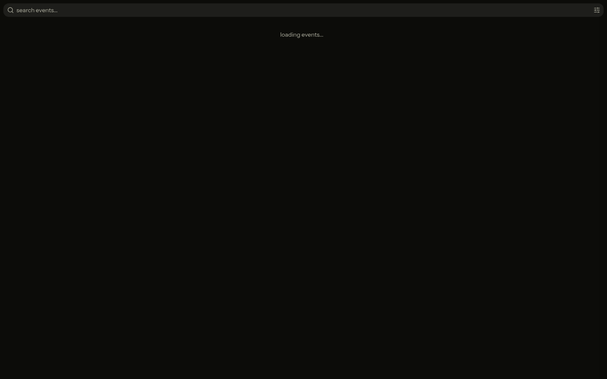
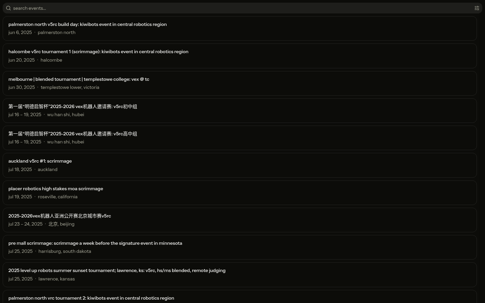
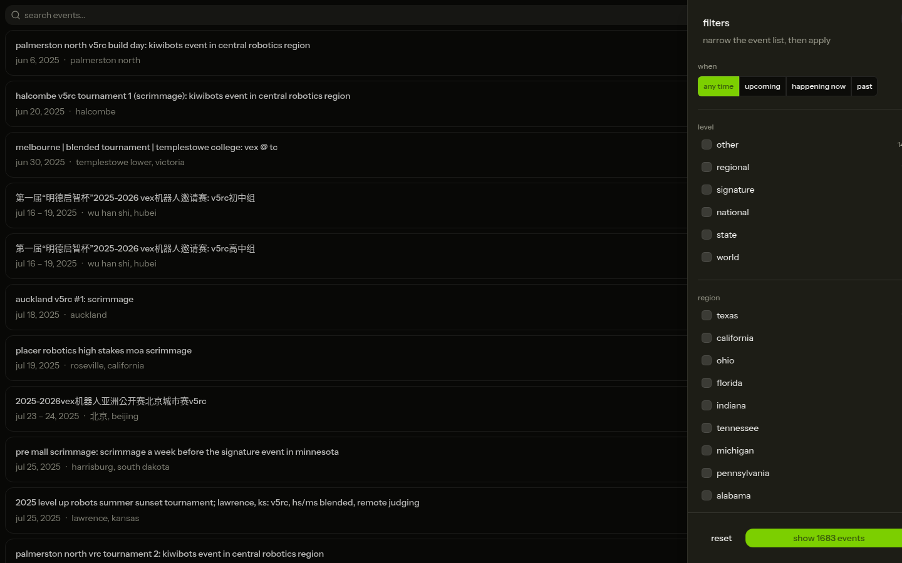
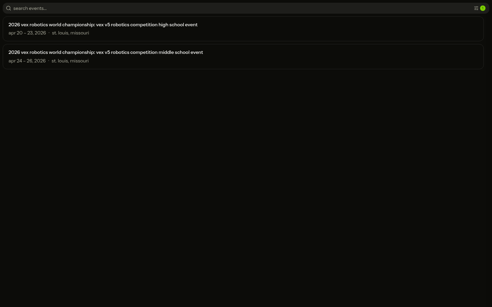
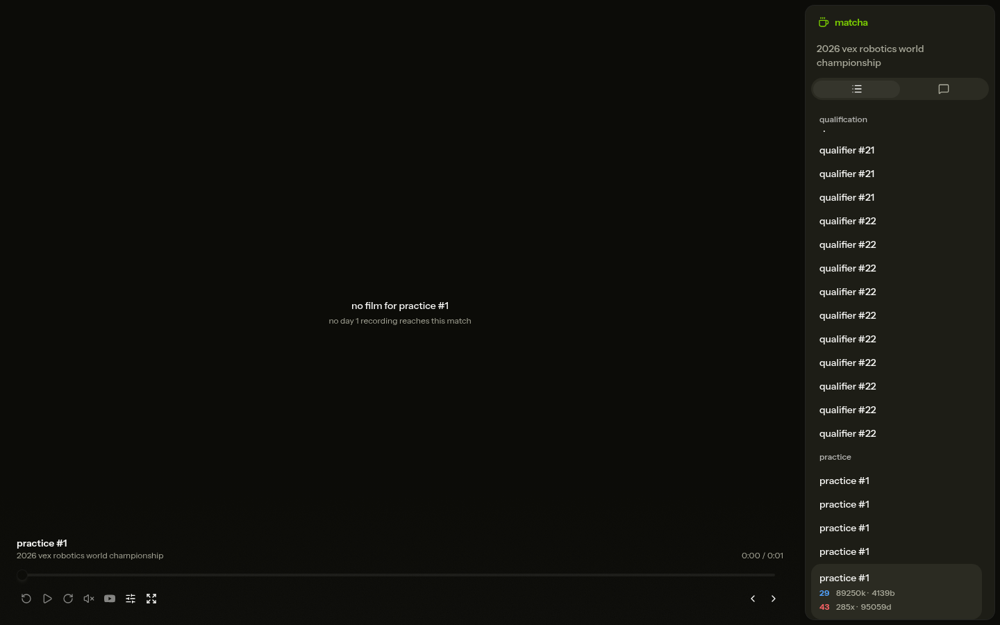
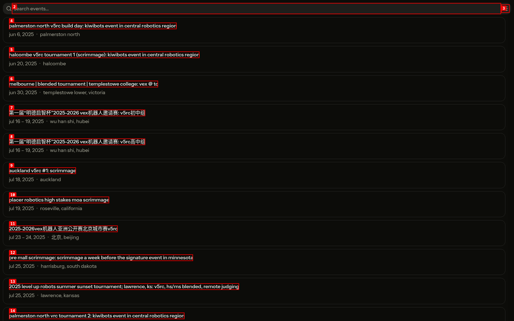
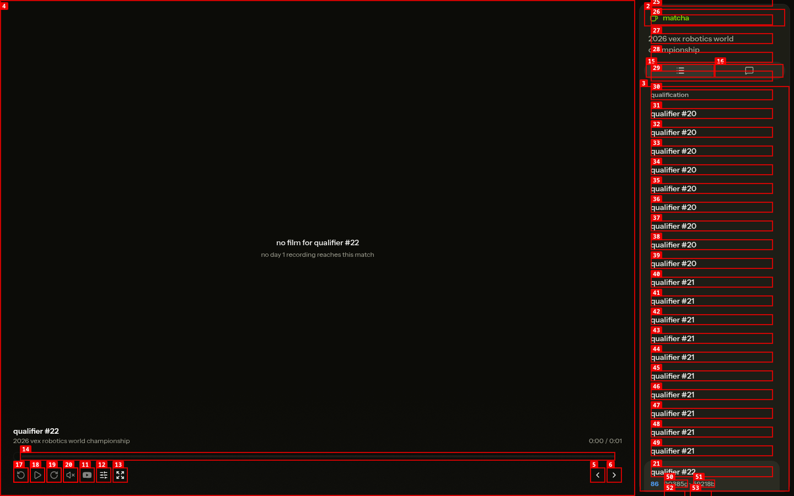
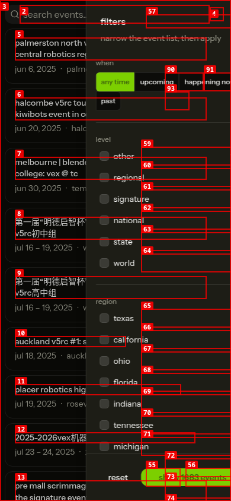

# Dogfood Report: matcha

| Field | Value |
|-------|-------|
| **Date** | 2026-08-05 |
| **App URL** | http://localhost:5173 |
| **Session** | matcha-pre-ship |
| **Scope** | Full app, excluding chat |

## Summary

| Severity | Count |
|----------|-------|
| Critical | 0 |
| High | 0 |
| Medium | 0 |
| Low | 0 |
| **Total** | **0** |

## Issues

### ISSUE-001: Refreshing `/events` destroys the event list

| Field | Value |
|-------|-------|
| **Severity** | critical |
| **Category** | functional / console |
| **URL** | http://127.0.0.1:4173/events |
| **Repro Video** | videos/issue-001-stable-repro.webm |

**Description**

The events list works after navigating from the landing page, but refreshing the same `/events` URL leaves a blank page while the address bar and document title still identify `/events`. The console reports a Svelte `hydration_mismatch`. During an earlier hot-reload window the same mismatch rendered the signed-out account screen at `/events`; on a freshly started server it reproduces consistently as a blank page. Direct links and refreshes therefore cannot be trusted to render the requested route.

**Repro Steps**

1. Navigate from the landing page to the working events list.
   

2. Refresh the page and wait for it to settle.

3. **Observe:** the URL remains `/events`, but the rendered page is blank rather than the event list.
   

---

### ISSUE-004: Returning from an event discards search context

| Field | Value |
|-------|-------|
| **Severity** | medium |
| **Category** | functional / ux |
| **URL** | http://127.0.0.1:4173/events |
| **Repro Video** | videos/issue-004-production-v3-repro.webm |

**Description**

Event filters are purely transient. After narrowing 1,683 events to the two world-championship results, opening one, and using browser Back, the app returns to the full unfiltered list at the top. Scouts lose the exact context and position they used to locate an event and must repeat the filtering workflow every time.

**Repro Steps**

1. Open filters from the full event list.
   

2. Select the `world` level and apply the two-event result.
   
   

3. Open the high-school world championship event.
   

4. Use browser Back.

5. **Observe:** the app shows all 1,683 events from the beginning instead of restoring the two world results.
   

---

### ISSUE-003: Match entries are indistinguishable at multi-division events

| Field | Value |
|-------|-------|
| **Severity** | medium |
| **Category** | ux / accessibility |
| **URL** | http://127.0.0.1:5173/events/64025 |
| **Repro Video** | N/A |

**Description**

The 2026 high-school world championship presents many separate matches with the same visible and accessible name—ten consecutive links can all be called "qualifier #21" or "qualifier #22". Division/field and team identifiers are not shown until after one entry is selected. A scout cannot identify the intended match without opening duplicates one by one, and a screen-reader user hears an even longer run of identical links.

**Repro Steps**

1. Open the 2026 high-school world championship event and inspect the match list.

2. **Observe:** many different links share identical labels and expose no distinguishing division or teams.
   

---

### ISSUE-002: Mobile filters overflow and obscure their own controls

| Field | Value |
|-------|-------|
| **Severity** | medium |
| **Category** | visual / ux |
| **URL** | http://127.0.0.1:5173/events |
| **Repro Video** | N/A |

**Description**

At a 390 × 844 viewport, the filter drawer is too narrow for the time options. "happening now" is clipped off the right edge, "past" wraps onto a second row without coherent spacing, and the sticky reset/apply controls overlap the scrolling region list. The underlying event list also remains visibly exposed behind the drawer, making the selection surface difficult to read and operate.

**Repro Steps**

1. Open `/events` at a 390 × 844 viewport and open filters.

2. **Observe:** clipped time filters and overlapping bottom controls.
   

---
